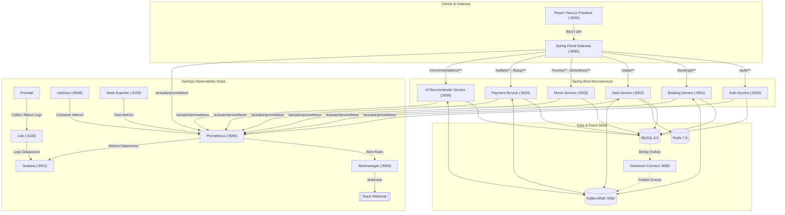

# 🎬 Movie Booking Microservices Platform


-black>)


Hệ thống Đặt vé Xem phim Microservices sản xuất (Production-Grade) được xây dựng trên nền tảng **Java Spring Boot 3.3**, kiến trúc **Event-Driven Saga Pattern (Debezium CDC + Kafka)**, mô hình AI gợi ý phim với **Deep Java Library (DJL) + ONNX Runtime**, tích hợp cổng thanh toán **payOS** và bộ công cụ **DevOps Monitoring & Observability (Prometheus, Grafana, Loki, Alertmanager, Slack)** toàn diện.

---

## 🏛️ 1. Kiến trúc Hệ thống (System Architecture)



---

## 🧩 2. Danh sách Microservices & Hạ tầng (Services & Port Map)

| Component           | Port            | Công nghệ / Framework                       | Mô tả chức năng                                                           |
| ------------------- | --------------- | ------------------------------------------- | ------------------------------------------------------------------------- |
| **API Gateway**     | `8080`          | Spring Cloud Gateway (Reactive WebFlux)     | Routing API, CORS, Rate Limiting, Centralized Entrypoint                  |
| **Auth Service**    | `5005`          | Spring Boot, Spring Security, JJWT          | Đăng ký, Đăng nhập, Xác thực JWT, Quản lý Roles                           |
| **Booking Service** | `5001`          | Spring Boot, Spring Data JPA, Debezium CDC  | Quản lý quy trình đặt vé, Tạo Saga Outbox Events                          |
| **Seat Service**    | `5002`          | Spring Boot, Redis, Kafka Consumer          | Đặt chỗ tạm thời (Seat Lock), Đồng bộ trạng thái ghế realtime             |
| **Movie Service**   | `5003`          | Spring Boot, Spring Data JPA                | Quản lý danh mục phim, Cụm rạp, Rạp chiếu, Lịch chiếu                     |
| **Payment Service** | `5004`          | Spring Boot, payOS SDK, Kafka Consumer      | Ví tiền điện tử, Thanh toán vé, Nạp tiền payOS Webhook                    |
| **AI Recommender**  | `5006`          | Spring Boot, DJL, ONNX Runtime, HuggingFace | Model gợi ý phim AI (`all-MiniLM-L6-v2` Vector Embeddings)                |
| **Frontend**        | `3000`          | React / Next.js / Vite                      | Giao diện người dùng chọn phim, chọn ghế, nạp tiền và đặt vé              |
| **MySQL Database**  | `3306`          | MySQL 8.0 (Binlog ROW Enabled)              | Cơ sở dữ liệu quan hệ cho các microservices (`auth_db`, `booking_db`,...) |
| **Redis Cache**     | `6379`          | Redis 7 Alpine                              | Cache lịch chiếu, Lock giữ ghế thời gian thực                             |
| **Kafka Broker**    | `9092` / `9094` | Apache Kafka 3.7.0 (KRaft mode)             | Message Broker bất đồng bộ cho Saga Event Processing                      |
| **Kafka UI**        | `8099`          | Provectus Kafka UI                          | Giao diện quản lý Topics, Consumers, Messages                             |
| **Debezium CDC**    | `8083`          | Debezium Connect 2.5                        | Change Data Capture (CDC) lắng nghe Outbox Table đẩy lên Kafka            |

---

## 📊 3. Bộ công cụ DevOps Monitoring & Observability Stack

| Tool              | Port   | Endpoint / Công dụng                                                                      |
| ----------------- | ------ | ----------------------------------------------------------------------------------------- |
| **Prometheus**    | `9090` | `http://localhost:9090` — Thu thập & lưu trữ metrics từ Actuator, cAdvisor, Node Exporter |
| **Grafana**       | `3001` | `http://localhost:3001` — Dashboard trực quan hóa (Spring Boot, Docker, Host Ubuntu)      |
| **Alertmanager**  | `9093` | `http://localhost:9093` — Quản lý alert rules, gửi thông báo FIRING / RESOLVED sang Slack |
| **Loki**          | `3100` | `http://localhost:3100` — Centralized Log Management (Hệ thống lưu trữ log tập trung)     |
| **Promtail**      | —      | Thu thập Docker container stdout logs, gán label và tự động **Redact** thông tin nhạy cảm |
| **cAdvisor**      | `8098` | Direct Container Metrics (CPU %, Memory, Network I/O)                                     |
| **Node Exporter** | `9100` | Host Metrics (Ubuntu CPU, RAM, Disk, System Load Average)                                 |

---

## ⚙️ 4. Yêu cầu Tiền đề (Prerequisites)

Trước khi khởi chạy hệ thống, đảm bảo máy tính/server của bạn đã cài đặt:

- **Java Development Kit (JDK)**: Java 17+
- **Apache Maven**: Version 3.9+
- **Docker & Docker Compose**: Docker Engine 24+ & Docker Compose v2+
- **Node.js**: Node 18+ (Dành cho việc chạy Frontend local)

---

## 🔐 5. Cấu hình Biến môi trường (Environment Setup)

Hệ thống quản lý biến môi trường qua file `.env` ở thư mục gốc project.

1. **Tạo file `.env` từ file mẫu:**
   ```bash
   cp .env.example .env
   ```
2. **Cấu hình các giá trị trong `.env`:**

   ```env
   # --- General ---
   COMPOSE_PROJECT_NAME=movie-ticket-booking
   ENVIRONMENT=development

   # --- Database & Infra ---
   DB_HOST=localhost
   DB_PORT=3306
   DB_USERNAME=root
   DB_PASSWORD=123456

   # --- Slack Webhook (Alerting) ---
   SLACK_WEBHOOK_URL=https://hooks.slack.com/services/YOUR/SLACK/WEBHOOK_URL

   # --- Grafana Credentials ---
   GRAFANA_ADMIN_USER=admin
   GRAFANA_ADMIN_PASSWORD=admin

   # --- Alerting Thresholds (Tham số hóa ngưỡng cảnh báo) ---
   ALERT_CPU_THRESHOLD=80
   ALERT_RAM_THRESHOLD=80
   ALERT_DISK_THRESHOLD=85
   ALERT_5XX_RATE_THRESHOLD=0.05
   ALERT_LATENCY_P95_THRESHOLD=3
   ALERT_CONTAINER_CPU_THRESHOLD=80
   ALERT_CONTAINER_RAM_THRESHOLD=85
   ```

---

## 💻 6. Hướng dẫn Khởi chạy Môi trường Local Development

Môi trường **Local Development** giúp lập trình viên phát triển và debug nhanh chóng:

- **Hạ tầng (Infrastructure)** chạy trên Docker.
- **Microservices (Java Spring Boot)** chạy trực tiếp từ IDE (IntelliJ IDEA, Eclipse) hoặc Maven command line.

### Bước 1: Khởi chạy Hạ tầng Docker (MySQL, Redis, Kafka, Debezium)

```bash
docker compose up -d
```

> _(Chỉ khởi chạy 5 dịch vụ hạ tầng core: `mysql`, `redis`, `kafka`, `kafka-ui`, `debezium`)_

Kiểm tra trạng thái container:

```bash
docker compose ps
```

### Bước 2: Build toàn bộ dự án Maven

```bash
mvn clean compile -DskipTests
```

### Bước 3: Khởi chạy từng Microservice

Có thể chạy từng service từ IDE hoặc mở terminal riêng cho từng service:

```bash
# Terminal 1: Auth Service
mvn spring-boot:run -pl auth-service

# Terminal 2: Booking Service
mvn spring-boot:run -pl booking-service

# Terminal 3: Seat Service
mvn spring-boot:run -pl seat-service

# Terminal 4: Movie Service
mvn spring-boot:run -pl movie-service

# Terminal 5: Payment Service
mvn spring-boot:run -pl payment-service

# Terminal 6: AI Recommender Service
mvn spring-boot:run -pl ai-recommender-service

# Terminal 7: API Gateway
mvn spring-boot:run -pl gateway
```

### Bước 4: (Tùy chọn) Mở bộ Monitoring Stack ở Local

Nếu muốn kiểm tra Prometheus, Grafana ở local trong lúc code:

```bash
docker compose --profile monitoring up -d
```

---

## 🚀 7. Hướng dẫn Khởi chạy Môi trường Production (Ubuntu 24.04 VM)

Ở môi trường Production (hoặc staging server Linux Ubuntu), toàn bộ hệ thống (Microservices + Hạ tầng + Monitoring Stack) được container hóa và quản lý tập trung bằng **Docker Compose Profiles**.

### Khởi chạy Full Stack bằng 1 câu lệnh duy nhất:

```bash
docker compose --profile "*" up -d --build
```

_Hoặc khởi chạy từng profile cụ thể:_

```bash
# Khởi chạy toàn bộ App + Monitoring (bỏ qua profile không dùng)
docker compose --profile production --profile monitoring up -d --build
```

### Kiểm tra tình trạng hoạt động toàn bộ hệ thống:

```bash
docker compose ps
```

---

## 📡 8. Kiểm tra Monitoring & Observability Stack

### 8.1. Endpoints Actuator Prometheus

Truy cập các URL sau để kiểm tra métrics định dạng Prometheus:

- API Gateway: `http://localhost:8080/actuator/prometheus`
- Auth Service: `http://localhost:5005/actuator/prometheus`
- Booking Service: `http://localhost:5001/actuator/prometheus`
- Seat Service: `http://localhost:5002/actuator/prometheus`
- Movie Service: `http://localhost:5003/actuator/prometheus`
- Payment Service: `http://localhost:5004/actuator/prometheus`
- AI Recommender: `http://localhost:5006/actuator/prometheus`

### 8.2. Truy cập Grafana Dashboards

- URL: `http://localhost:3001`
- Tài khoản: `admin` / `admin` (Hoặc theo cấu hình `GRAFANA_ADMIN_PASSWORD` trong `.env`)
- Tự động tích hợp sẵn **3 Dashboards chuyên nghiệp**:
  1. **Spring Boot Microservices**: Request Rate (req/s), HTTP 4xx/5xx Errors, Latency Quantiles (p50/p95/p99), JVM Memory Heap/Non-Heap, CPU %, Active Threads, Service UP/DOWN.
  2. **Docker Containers**: cAdvisor Container CPU %, RAM Usage, Network Received/Transmitted, Active Container Count.
  3. **Host System (Ubuntu)**: Node Exporter Host CPU %, RAM Gauge, Disk Space %, System Load Average, Network Interface Traffic.

### 8.3. Truy cập Centralized Logs (Loki + Promtail)

1. Đăng nhập vào Grafana (`http://localhost:3001`).
2. Vào mục **Explore** ➔ Chọn Datasource **Loki**.
3. Tra cứu Log theo container/service:
   ```logql
   {service="movie-booking-booking-service"}
   ```
   \*Lưu ý: Promtail tự động Redact các chuỗi nhạy cảm như `password`, `secret`, `jwt`, `api-key`, `webhook` thành `***REDACTED***`.\*

### 8.4. Kiểm tra Cảnh báo Slack (Alertmanager Test)

Hệ thống tự động đẩy cảnh báo sang Slack `#alerts` khi có sự cố.

**Thử nghiệm quy trình Cảnh báo End-to-End:**

1. Stop 1 service bất kỳ:
   ```bash
   docker compose stop movie-booking-auth-service
   ```
2. Sau 1 phút:
   - Prometheus phát hiện target offline ➔ Chuyển trạng thái alert `PrometheusTargetDown` sang **FIRING**.
   - Alertmanager nhận alert ➔ Đẩy tin nhắn thông báo màu đỏ `🔥 FIRING [CRITICAL]` sang kênh Slack kèm thông số chi tiết.
3. Start lại service:
   ```bash
   docker compose start movie-booking-auth-service
   ```
4. Sau 1 phút:
   - Alertmanager tự động gửi tin nhắn phục hồi màu xanh `✅ RESOLVED [CRITICAL]` sang Slack.

---

## 🛠️ 9. Các lệnh Docker hữu ích (Cheat Sheet)

```bash
# Xem log realtime của một service cụ thể
docker compose logs -f booking-service

# Xem log của toàn bộ hệ thống monitoring
docker compose --profile monitoring logs -f

# Stop toàn bộ hệ thống
docker compose --profile "*" down

# Restart lại Prometheus sau khi sửa file .env
docker compose --profile monitoring restart prometheus

# Rebuild lại duy nhất 1 microservice trong Docker
docker compose --profile production up -d --build auth-service
```

---
